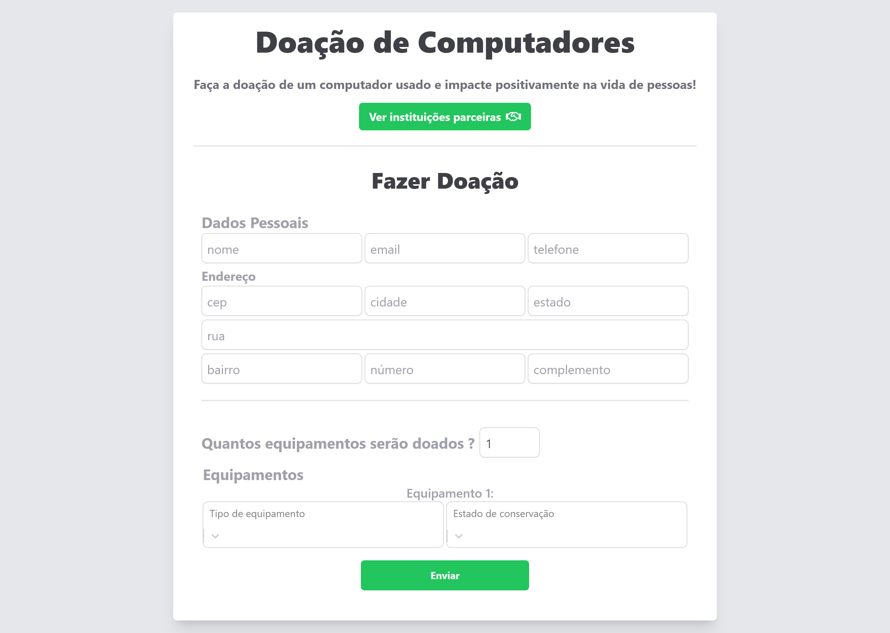
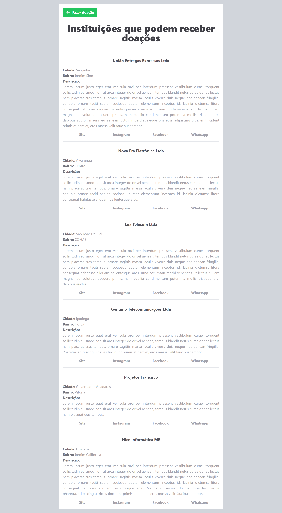

# Projeto de seleção para estágio JavaScript da [App Masters](https://www.appmasters.io/)

## 💻 Projeto

O objetivo deste projeto é ajudar pessoas que queiram doar seus computadores usados para pessoas necessitadas, ao invés de serem descartados.

O projeto pode ser acessado [aqui](https://doar-computadores-yaghomattos.vercel.app/)

## 🛠️ Construído com

- [Next.js](https://nextjs.org/) - React framework base
- [Yup](https://github.com/jquense/yup) - Validação dos dados do formulário
- [Axios](https://axios-http.com/) - Cliente HTTP
- [Tailwind CSS](https://tailwindcss.com/) - Estilização
- [React Icons](https://react-icons.github.io/react-icons/) - Biblioteca de ícones
- [React-input-mask](https://github.com/sanniassin/react-input-mask) - Máscara para os inputs
- [React Select](https://react-select.com/home) - Input de seleção

## 🖼️ Screenshots do projeto

- Home | Home em tela menor

    
    

- Instituições | Instituições em tela menor

    
    

